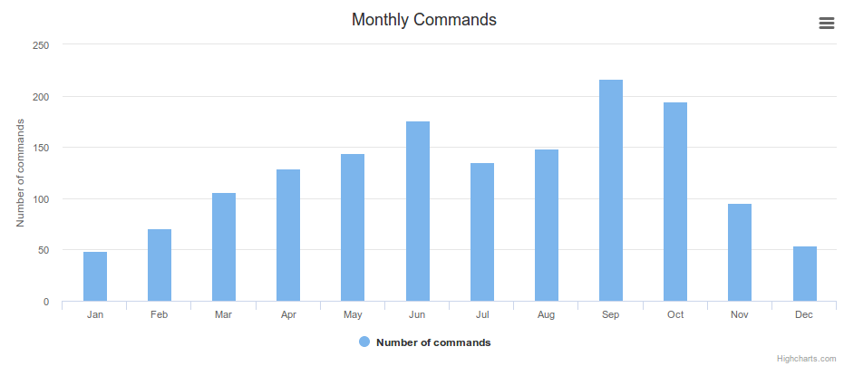
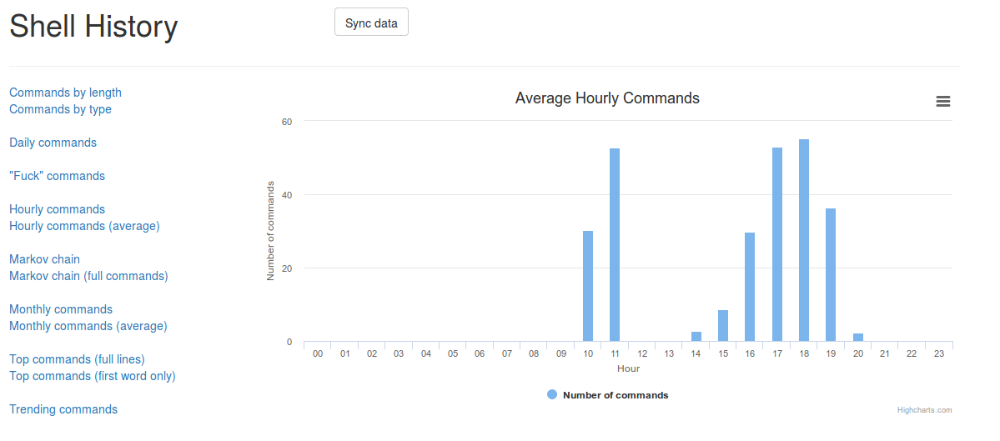

# BashHist
Inspired from https://github.com/bamos/zsh-history-analysis.

Visualize your usage of Bash/Zsh through a web app thanks
to Flask and Highcharts.

**Alpha stage! Actual history is not used (only fixtures right now).**

## Dependencies
Only Flask: `pip install flask`. You will also need Internet connection since
assets are not bundled.

## Installation
Clone the repo with `git clone https://github.com/Pawamoy/shellhist`.

ShellHist needs a lot of info to be able to display various charts. The basic
shell history is not enough. In order to generate the necessary information,
you have to source the `use_extended_history.sh` script.

**Be reassured, it will leave your history file and configuration untouched.**

It will append your commands in a second file in your home:
`.shell_history_extended`.

Only two things will be modified in your shell environment:
- your `PROMPT_COMMAND` variable for Bash, or your `precmd` function for Zsh,
- the trap on `DEBUG` signal.

So, at shell startup, in `.bashrc` or `.zshrc`, put a line like the following:

```bash
# make sure nothing is prepended to PROMPT_COMMAND or precmd after this line
. '/path/to/shellhist/use_extended_history.sh'
```

... and now use your shell normally!

## Usage
Simply `./run.sh`, or run it manually with `FLASK_APP=app.py flask run`.
Now go to http://127.0.0.1:5000/ and enjoy!

## Charts example



## How it works
