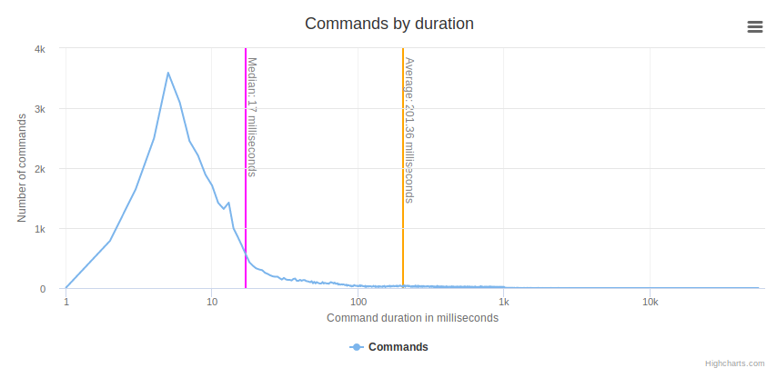
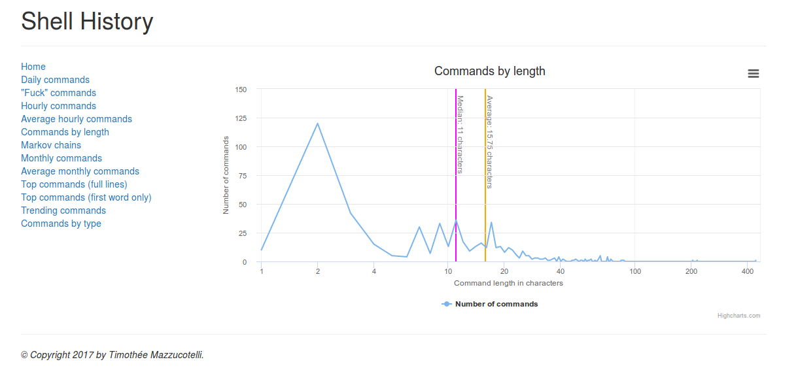
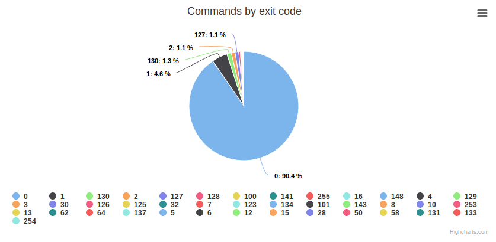
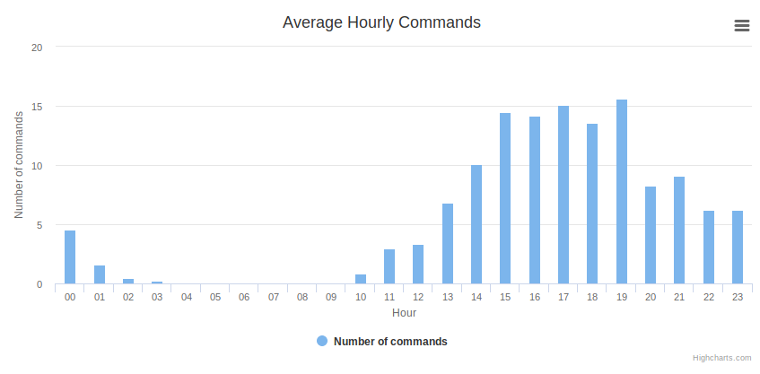
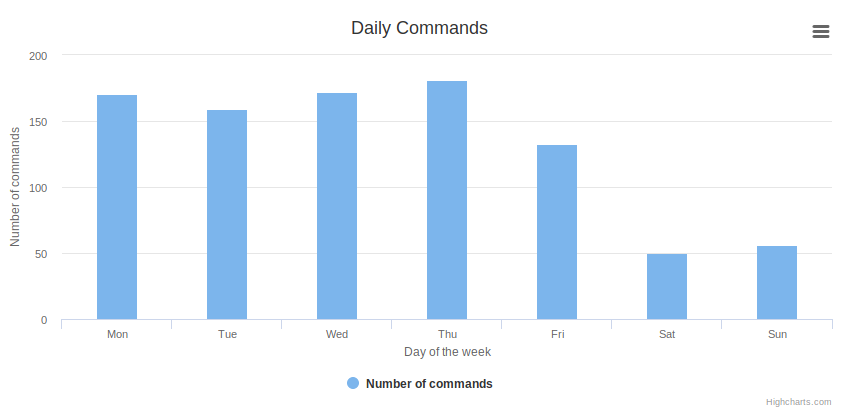
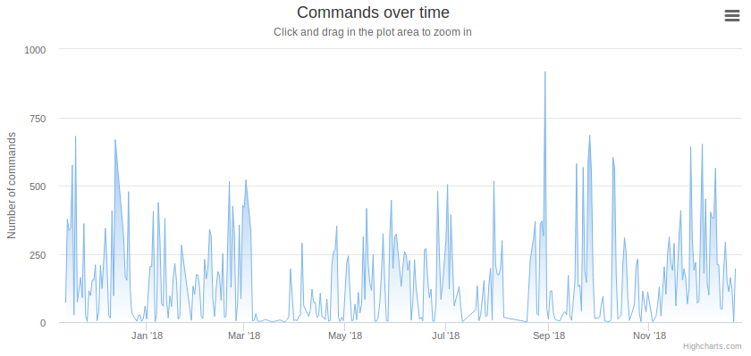
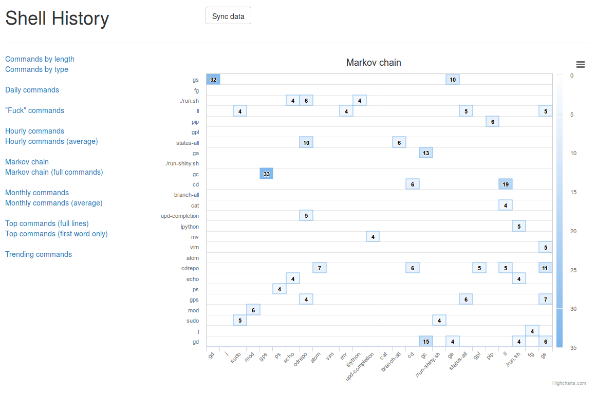
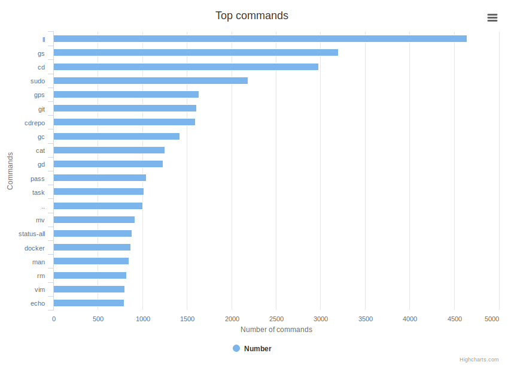

# Shell History
[](https://gitlab.com/pawamoy/shell-history/commits/master)

Inspired by [bamos/zsh-history-analysis](https://github.com/bamos/zsh-history-analysis).

Visualize your usage of Bash/Zsh through a web app
thanks to [Flask](http://flask.pocoo.org/) and [Highcharts](https://www.highcharts.com/)!

<table>
  <tr align="center">
    <td>Duration</td>
    <td>Length</td>
    <td>Type</td>
  </tr>
  <tr align="center">
    <td>Exit code</td>
    <td>Hourly</td>
    <td>Daily</td>
  </tr>
  <tr align="center">
    <td>Over time</td>
    <td>Markov chain</td>
    <td>Top commands</td>
  </tr>
</table>

<p align="center"><i>Post your charts ideas in <a href="https://github.com/pawamoy/shell-history/issues/9">this issue</a>!</i></p>

- [Requirements](#requirements)
- [Installation](#installation)
- [Setup](#setup)
- [Usage](#usage)
- [Some technical info](#some-technical-info)
  - [How it works](#how-it-works)
  - [History file format](#history-file-format)
  - [How we get the values](#how-we-get-the-values)
- [License](#license)

## Requirements
`shellhistory` requires Python 3.6 or above.

<details>
<summary>To install Python 3.6, I recommend using <a href="https://github.com/pyenv/pyenv"><code>pyenv</code></a>.</summary>

```bash
# install pyenv
git clone https://github.com/pyenv/pyenv ~/.pyenv

# setup pyenv (you should also put these two lines in .bashrc or similar)
export PATH="${HOME}/.pyenv/bin:${PATH}"
eval "$(pyenv init -)"

# install Python 3.6
pyenv install 3.6.7

# make it available globally
pyenv global system 3.6.7
```
</details>

## Installation
With `pip`:
```bash
python3.6 -m pip install shellhistory
```

With [`pipx`](https://github.com/pipxproject/pipx):
```bash
python3 -m pip install --user pipx

pipx install --python python3.6 shellhistory
```

## Setup
`shellhistory` needs a lot of info to be able to display various charts.
The basic shell history is not enough. In order to generate the necessary
information, you have to enable the shell extension.

At shell startup, in `.bashrc` or `.zshrc`, put the following:

```bash
# only load it for interactive shells
if [[ $- == *i* ]] && command -v shellhistory-location &>/dev/null; then
    . $(shellhistory-location)
    shellhistory enable
fi
```

... and now use your shell normally!

If you want to stop `shellhistory`, simply run `shellhistory disable`.

**Note:** *for performance reasons, you can also use the static,
absolute path to the source file.
Indeed, calling `shellhistory-location` spawns a Python process
which can slow down your shell startup.
Get the path once with `shellhistory-location`, and use `. <ABS_PATH>`.
In my case it's `. ~/.local/pipx/venvs/shellhistory/lib/python3.6/site-packages/shellhistory/shellhistory.sh`.*

## Usage
Launch the web app with `shellhistory-web`.
Now go to [http://localhost:5000/](http://localhost:5000/) and enjoy!

You will need Internet connection since assets are not bundled.

## Some technical info
### How it works
When you enter a command, `shellhistory` will compute values
*before* and *after* the command execution.
In Bash, it uses a trap on DEBUG and the PROMPT_COMMAND variable
(`man bash` for more information).
For Zsh, it uses the preexec_functions and precmd_functions arrays
(anyone knows where to find the official documentation for these?
Some information in `man zshmisc`).

Before the command is executed, we start a timer, compute the command type,
and store the current working directory and the command itself.

After the command has finished, we store the return code, and stop the timer.

### History file format
Fields saved along commands are start and stop timestamps, hostname, username,
uuid (generated), tty, process' parents, shell, shell level, command type,
return code, and working directory (path), in the following format:
`:start:stop:uuid:parents:host:user:tty:path:shell:level:type:code:command`.

- multi-line commands are prepended with a semi-colon `;` instead of a colon `:`,
  starting at second line
- start and stop timestamps are in microseconds since epoch
- process' parents and working directory are encoded in base64 to avoid
  delimiter corruption.

Example (multi-line command):

```
:1510588139930150:1510588139936608:40701d9b-1807-4a3e-994b-dde68692aa14:L2Jpbi9iYXNoCi91c3IvYmluL3B5dGhvbiAvdXNyL2Jpbi94LXRlcm1pbmFsLWVtdWxhdG9yCi91c3IvYmluL29wZW5ib3ggLS1zdGFydHVwIC91c3IvbGliL3g4Nl82NC1saW51eC1nbnUvb3BlbmJveC1hdXRvc3RhcnQgT1BFTkJPWApsaWdodGRtIC0tc2Vzc2lvbi1jaGlsZCAxMiAyMQovdXNyL3NiaW4vbGlnaHRkbQovc2Jpbi9pbml0Cg==:myhost:pawamoy:/dev/pts/1:L21lZGlhL3Bhd2Ftb3kvRGF0YS9naXQvc2hlbGxoaXN0Cg==:/bin/bash:1:builtin:0:echo "a
;b
;c" | wc -c
```

**Note:** later we could use CSV formatting, quoting
strings and doubling double-quotes in those if any.
It would make the file more readable for humans,
and easily importable in other programs.
See [issue 26](https://github.com/pawamoy/shell-history/issues/26).

The previous example would look like this:
```
1510588139930150,1510588139936608,40701d9b-1807-4a3e-994b-dde68692aa14,"/bin/bash
/usr/bin/python /usr/bin/x-terminal-emulator
/usr/bin/openbox --startup /usr/lib/x86_64-linux-gnu/openbox-autostart OPENBOX
lightdm --session-child 12 21
/usr/sbin/lightdm
/sbin/init",myhost,pawamoy,/dev/pts/1,"/media/pawamoy/Data/git/shellhist",/bin/bash,1,builtin,0,"echo ""a
b
c"" | wc -c"
```

### How we get the values
Start and stop time are obtained with `date '+%s%N'`, return code is passed
directly with `$?`, working directory is obtained with `$PWD` and command
type with `type` for Bash and `whence` for Zsh.

Values for UUID, parents, hostname, and TTY are computed only once, when
`shellhistory.sh` is sourced. Indeed they do not change during usage of the current
shell process. Hostname and TTY are obtained through commands `hostname` and
`tty`. UUID is generated with command `uuidgen`. Also note that UUID
is exported in subshells so we know which shell is a subprocess of another, and
so we are able to group shell processes by "sessions", a session being an opened
terminal (be it a tab, window, pane or else). Parents are obtained with a
function that iteratively greps `ps` result with PIDs (see `shellhistory.sh`).

Values for user, shell, and level are simply obtained through environment
variables: `$USER`, `$SHELL` (though its use here is incorrect:
see [issue 24](https://github.com/pawamoy/shell-history/issues/24)),
and `$SHLVL` (also see [issue 25](https://github.com/pawamoy/shell-history/issues/25)).

The last command is obtained with the command `fc`.
Using `fc` allows `shellhistory` to have the same behavior as your history:
- if commands starting with spaces are ignored, they will be ignored
  in `shellhistory` as well.
- same for duplicates (entering `ls` two or more times
  saves only the first instance). Note however that if you type the same command
  as the previous one in an other terminal, it will still be appended,
  unless you manage to synchronize your history between terminals,
  which is another story.

Additionally, if you enter an empty line,
or hit Control-C before enter, nothing will be appended either.
The trick behind this is to check the command number in the current history
(see `shellhistory.sh` for technical details).

## License
Software licensed under the
[ISC](https://www.isc.org/downloads/software-support-policy/isc-license/)
license. See the [LICENSE](/LICENSE) file.
