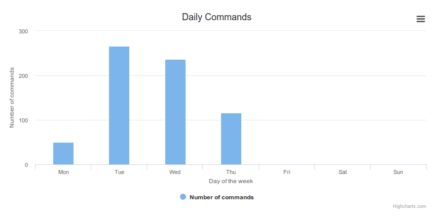

# Shell History
[](https://gitlab.com/Pawamoy/shell-history/commits/master)

Inspired by https://github.com/bamos/zsh-history-analysis.

Visualize your usage of Bash/Zsh through a web app
thanks to Flask and Highcharts.

- [Installation](#installation)
- [Usage](#usage)
- [How it looks](#how-it-looks)
- [How it works](#how-it-works)
- [History file format](#history-file-format)
- [Chart ideas](#chart-ideas)
- [License](#license)

## Installation
Clone the repo with `git clone https://github.com/Pawamoy/shell-history`.

Run `make install` or `./scripts/setup.sh` to install the dependencies in
the current directory.

`shell-history` needs a lot of info to be able to display various charts.
The basic shell history is not enough. In order to generate the necessary
information, you have to source the `shellhistory.sh` script, and activate
`shell-history`.

So, at shell startup, in `.bashrc` or `.zshrc`, put the following:

```bash
# make sure nothing is prepended to PROMPT_COMMAND or precmd after this line
. '/path/to/shell-history/shellhistory.sh'
shellhistory enable
```

... and now use your shell normally!

If you want to stop `shell-history`, simply run `shellhistory disable`.

## Usage
Launch the web app with `make run` or `./scripts/run.sh`.
Now go to http://127.0.0.1:5000/ and enjoy!

For more convenience, you can put a script in your PATH, for example in
`/usr/bin/`, with the following contents:

```bash
#!/usr/bin/env bash

SHELLHISTORY_DIR=/path/to/shell-history  # update this line
export SHELLHISTORY_VENV=${SHELLHISTORY_DIR}/venv
export SHELLHISTORY_FILE=~/.shell_history/history
export SHELLHISTORY_DB=~/.shell_history/db

cd ${SHELLHISTORY_DIR} || exit 1
./scripts/run.sh
```

You will need Internet connection since assets are not bundled.

## How it looks





## How it works
In order to append a line each time a command is entered, the `PROMPT_COMMAND`
variable and the `precmd` function are used, respectively for Bash and Zsh.
They allow us to execute arbitrary instructions just before command execution,
or before the command prompt is displayed, meaning, just after the last command
has returned.

This is where we compute the start and stop time, return code, working
directory and command type, and append the line into our history file.
Start and stop time are obtained with `$(date '+%s%N')`, return code is passed
directly with `$?`, working directory is obtained with `$PWD` and command
type with `$(type -t arg)` for Bash and `$(type -w arg)` for Zsh.

Values for UUID, parents, hostname, and TTY are computed only once, when
`shellhistory.sh` is sourced. Indeed they do not change during usage of the current
shell process. Hostname and TTY are obtained through commands `$(hostname)` and
`$(tty)`. UUID is generated with command `$(uuidgen)`. Also note that UUID
is exported in subshells so we know which shell is a subprocess of another, and
so we are able to group shell processes by "sessions", a session being an opened
terminal (be it a tab, window, pane or else). Parents are obtained with a
function that iteratively greps `ps` result with PIDs (see `shellhistory.sh`).

Values for user, shell, and level are simply obtained through environment
variables: `$USER`, `$SHELL`, and `$SHLVL`.

Start time is computed just before the entered command is run by the shell,
thanks to a trap on the DEBUG signal. From Bash manual about `trap`:

>If a sigspec is DEBUG, the command arg is executed before every simple command.

The last command is obtained with the command `fc`. It will feel like your
history configuration is mimic'd by the extended history. If the commands
beginning with a space are ignored, `shell-history` will notice it and will not
append these commands. Same for ignored duplicates. If you enter an empty line,
or hit Control-C before enter, nothing will be appended either. The trick behind
this is to check the command number in the current history (see `shellhistory.sh`
for technical details). Note however that if you type the same command in an
other terminal, it will still be appended, unless you manage to synchronize your
history between terminals.

## History file format
Fields saved along commands are start and stop timestamps, hostname, username,
uuid (generated), tty, process' parents, shell, shell level, command type,
return code, and working directory (path), in the following format:
`:start:stop:uuid:parents:host:user:tty:path:shell:level:type:code:command`.

- multiline commands are prepended with a semi-colon `;` instead of a colon `:`,
  starting at second line
- start and stop timestamps are in microseconds since epoch
- process' parents and working directory are encoded in base64 to avoid
  delimiter corruption

Example (multiline command):

```
:1510588139930150:1510588139936608:40701d9b-1807-4a3e-994b-dde68692aa14:L2Jpbi9iYXNoCi91c3IvYmluL3B5dGhvbiAvdXNyL2Jpbi94LXRlcm1pbmFsLWVtdWxhdG9yCi91c3IvYmluL29wZW5ib3ggLS1zdGFydHVwIC91c3IvbGliL3g4Nl82NC1saW51eC1nbnUvb3BlbmJveC1hdXRvc3RhcnQgT1BFTkJPWApsaWdodGRtIC0tc2Vzc2lvbi1jaGlsZCAxMiAyMQovdXNyL3NiaW4vbGlnaHRkbQovc2Jpbi9pbml0Cg==:myhost:pawamoy:/dev/pts/1:L21lZGlhL3Bhd2Ftb3kvRGF0YS9naXQvc2hlbGxoaXN0Cg==:/bin/bash:1:builtin:0:echo 'a
;b
;c' | wc -c
```

## Chart ideas
You can post your ideas in this issue: https://github.com/Pawamoy/shell-history/issues/9.

## License
Software licensed under the
[ISC](https://www.isc.org/downloads/software-support-policy/isc-license/)
license.
